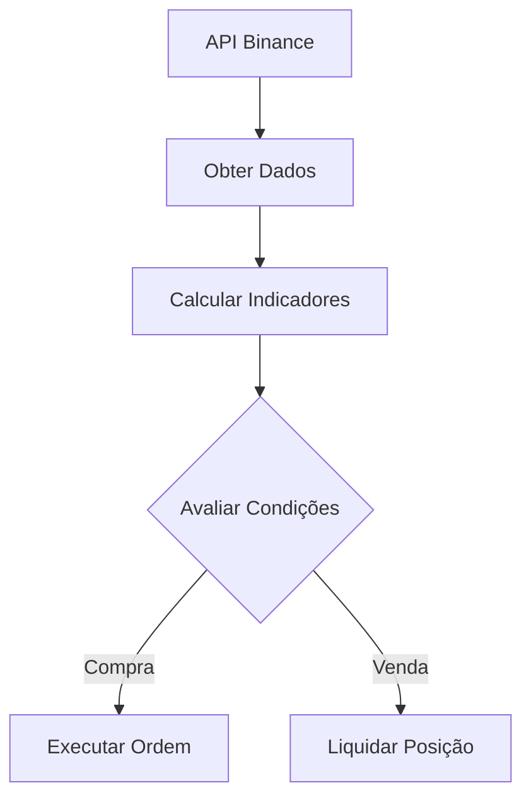

# 📈 FIDU - Trading Bot para Binance

**Bot automatizado para trading algorítmico com análise técnica (MACD, RSI e StochRSI) - Licenciado sob AGPL-3.0**

## ✨ Recursos Principais

### 📊 Estratégia Inteligente
- **Indicadores Técnicos**:
  - Análise em tempo real com MACD, RSI e Stochastic RSI
  - Parâmetros totalmente personalizáveis
  - Lógica de compra/venda em múltiplos níveis

### 🔒 Gestão de Risco
- Limite configurável de operações
- Venda parcial/progressiva
- Verificação automática de saldo

### ⚙️ Tecnologia Robustas
- Integração direta com API Binance via CCXT
- Cálculos precisos com TA-Lib
- Ambiente de testes seguro (Testnet)

## 🚀 Comece Rápido

1. **Pré-requisitos**:
   
   ```bash
   pip install ccxt talib numpy python-decouple schedule
   ```
2. **Configuração (``.env``)**:
    ```
   BINANCE_API_KEY=sua_chave
   BINANCE_SECRET_KEY=sua_secret
   ```
3. **Execução**:
   ```bash
   python fidu.py
   ```
   
## 📈 Lógica Operacional

| Condição |	Compra |	Venda Ideal |	Venda Parcial |
| --- | --- | --- | --- |
| MACD | < 0 | > 0.5 | > 0.5 |
| RSI |	< 30 | > 65 |	> 65 |
| StochRSI | < 20 |	> 90 | > 85 |
| Ação | Compra até limite | Vende 100% |	Vende 33% |

## 💡 Melhores Práticas

1. **Testes**:
    - Use sempre a Binance Testnet primeiro
    - Comece com pequenos valores (0.1-0.5 SOL)

## 🛠️ Arquitetura


## 📚 Documentação Adicional
- [Guia Binance Testnet](https://testnet.binance.vision)
- [Referência CCXT](https://docs.ccxt.com/#/)
- [Padrões TA-Lib](https://ta-lib.org)

---

📜 **Licença**: GNU AGPLv3

⚠️ **Aviso**: Para fins educacionais - Teste exaustivamente antes de usar com fundos reais
